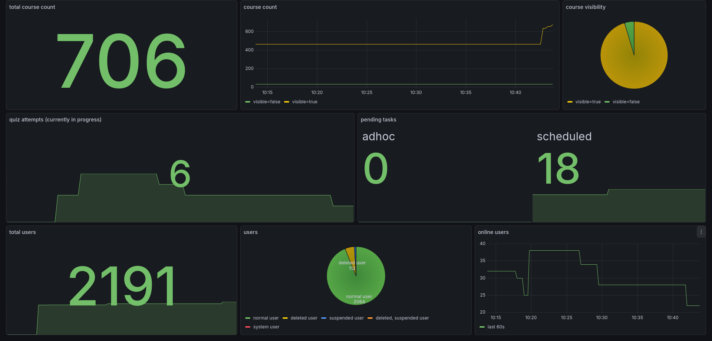
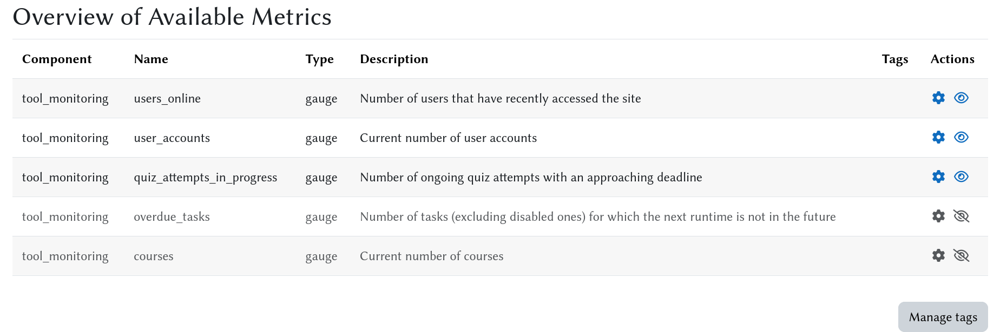

# Monitoring Moodle - `tool_monitoring`

The **`tool_monitoring`** Plugin makes it easy to integrate standard monitoring setups (such as [Prometheus][prometheus home] & [Grafana][grafana oss home]) with any running [Moodle][moodle home] instance.

Development started at the 2025 [Moodle Moot DACH][moodlemootdach home] DevCamp, where the project [won 1st prize][moodlemootdach 2025 votes], showing strong community demand for a standardized monitoring solution for Moodle.



<details open>
  <summary><strong>Table of Contents</strong> (Click to expand/collapse)</summary>

- [Features](#features)
- [Installation](#installation)
- [Usage](#usage)
  - [Admin Settings](#admin-settings)
  - [Grouping metrics with tags (optional)](#grouping-metrics-with-tags-optional)
  - [Prometheus configuration](#prometheus-configuration)
  - [Setting up a Grafana dashboard](#setting-up-a-grafana-dashboard)
  - [Adding a custom metric](#adding-a-custom-metric)
  - [Making a metric configurable (advanced)](#making-a-metric-configurable-advanced)
  - [Writing a custom exporter sub-plugin (advanced)](#writing-a-custom-exporter-sub-plugin-advanced)
- [Terminology](#terminology)
  - [Metric](#metric)
  - [Metric value](#metric-value)
  - [Metric type](#metric-type)
  - [Label](#label)
  - [Exporter](#exporter)
- [Architecture](#architecture)
  - [Base `metric` class](#base-metric-class)
  - [Hook `metric_collection`](#hook-metric_collection)
  - [DB table and `registered_metric` wrapper](#db-table-and-registered_metric-wrapper)
  - [Central `metrics_manager`](#central-metrics_manager)
  - [Configurable metrics (advanced)](#configurable-metrics-advanced)
  - [Exporter sub-plugins](#exporter-sub-plugins)
- [Copyright](#copyright)

</details>

## Features

- 🍱 **Just works**: Ready-made with [sensible Moodle metrics](#pre-installed-metrics) and a [Prometheus endpoint][prometheus docs instances] out of the box.
- 🏗️ **Extensible**: To define your own metric, simply extend the [`metric`][. metric] class and [register it for collection](#registering-the-metric).
- 🗃️ **Generic**: Agnostic towards the monitoring software used; supports custom [exporters](#exporter-sub-plugins).
- 🧑‍💻 **Admin-friendly**: Convenient [admin dashboard](#admin-settings) to view and configure individual metrics and exporters.
- 🔧 **Customizable**: For advanced use, metrics can be [configured](#configurable-metrics-advanced) and even tagged via the [Moodle Tag API][moodle docs tag api].

## Installation

The minimum supported Moodle version is [**5.0**][moodle docs release 5.0] (build 2025041400).

You install `tool_monitoring` just like any other Moodle plugin.
Starting with Moodle [**5.1**][moodle docs release 5.1], it belongs in the `public/admin/tool/monitoring` directory.
(For Moodle 5.0 it goes into `admin/tool/monitoring`.)

For example, using `git` from the root directory of your Moodle 5.1+ installation:

```shell
$ git clone \
      https://github.com/daniil-berg/moodle-tool_monitoring.git \
      public/admin/tool/monitoring
```

For other options and general plugin installation instructions, see the [official Moodle documentation][moodle docs plugin install].

## Usage

### Admin Settings

#### Dashboard

The admin dashboard can be found at `/admin/tool/monitoring` or by navigating to _Site administration_ > _Plugins_ > _Admin tools_ > _Monitoring_ > _Overview_.



There you can view all registered metrics, enable/disable them, add/remove metric tags, and configure some metrics individually.

#### Pre-installed metrics

Out of the box, `tool_monitoring` comes with the following metrics:

|            Name             | Description                                                  | Partitioned by                                                                       |         Configurable?         |
|:---------------------------:|--------------------------------------------------------------|--------------------------------------------------------------------------------------|:-----------------------------:|
|          `courses`          | Current number of courses.                                   | `visible` (`true`/`false`)                                                           |              no               |
|       `overdue_tasks`       | Number of tasks that should have run already but have not    | `type` (`adhoc`/`scheduled`)                                                         |              no               |
| `quiz_attempts_in_progress` | Number of ongoing quiz attempts with an approaching deadline | -                                                                                    | [yes](#metric-configuration)  |
|       `user_accounts`       | Current number of user accounts                              | `auth` (available methods), `suspended` (`true`/`false`), `deleted` (`true`/`false`) |              no               |
|       `users_online`        | Number of users that have recently accessed the site         | `time_window` (last user access time to count, multiple configurable)                | [yes](#metric-configuration)  |

> [!NOTE]
> Any Moodle component can add its own custom metrics.
> (See the section "[Adding a custom metric](#adding-a-custom-metric)" for details.)
> Once a metric is [registered](#registering-the-metric), it will be listed in the dashboard as well.

#### Metric configuration

Some metrics have their own specific configuration options.
🚧 TODO

#### Exporters

The pre-installed Prometheus exporter has its own settings under _Site administration_ > _Plugins_ > _Admin tools_ > _Monitoring_ > _Available Exporters_ > _Prometheus Exporter_.

The actual Prometheus endpoint is immediately accessible and can be reached at the route `/monitoringexporter_prometheus/metrics`.

That endpoint can be secured by specifying an access token in the `monitoringexporter_prometheus | prometheus_token` setting, which then must be provided in the `token` query parameter.
So if your Moodle web root is `https://example.com` and you set the `prometheus_token` to be `super-secure-secret`, the full URL will look like this:

`https://example.com/monitoringexporter_prometheus/metrics?token=super-secure-secret`

> [!IMPORTANT]
> This relies on the router and your webserver being properly configured.
> If not, the endpoint is reached at `/r.php/monitoringexporter_prometheus/metrics`.
> See the relevant [Moodle documentation][moodle docs routing config] for details.

### Grouping metrics with tags (optional)

🚧 TODO

### Prometheus configuration

This assumes you have a Prometheus server already up and running.
All you need to do is to add a job to the `scrape_configs` section in your `prometheus.yml` like this:

```yaml
scrape_configs:
   # Choose whatever unique job name you like.
  - job_name: moodle
    # The default scheme is HTTP.
    scheme: https
    # If you have set an access token, provide it here as a query parameter.
    params:
      - token: ['super-secure-secret']
    # Specify the full endpoint path. The default is just '/metrics'.
    # If Moodle routing is not fully configured, you have to prepend '/r.php' to the path.
    metrics_path: /monitoringexporter_prometheus/metrics
    # Specify the target host.
    static_configs:
      - targets: ['example.com']
```

If you are making use of tags to group specific metrics, you can filter for them by also specifying the `tag` query parameter.
Multiple tags can be specified by separating them with a comma.
For example, to only scrape metrics that have both the `hello` and the `world` tag, your `params` section would have look like this:

```yaml
    params:
      - token: ['super-secure-secret']
      - tag: ['hello,world']
```

For exhaustive details about the various config options, see the official [Prometheus documentation][prometheus docs config].

### Setting up a Grafana dashboard

This assumes you have configured Prometheus as described above.
You can import the example Grafana dashboard from [docs/examples/grafana_dashboard.json](docs/examples/grafana_dashboard.json) into grafana:

Go to "Dashboards" > "New" and select "import" and select the json-file or paste its content there.
Select the Prometheus data source and click "import". 

### Adding a custom metric

In its most basic form, adding a custom metric consists of just four steps:
1. Define the metric class.
2. Add a localized metric description.
3. Register the metric.
4. Enable the metric.

The following is an example of a metric that shows the **current number of [blocks][moodle docs blocks]** in use on the site.
For simplicity, we are only interested in the [**Courses**][moodle docs block courses] and [**Course/site summary**][moodle docs block course summary] blocks.

#### Defining the metric class

Let's say we have our own `local_example` plugin and the metric class is supposed to live in its `classes/metrics` directory.

<details open>
  <summary><code>classes/metrics/blocks_used.php</code> (Click to expand/collapse)</summary>

```php
namespace local_example\metrics;

use tool_monitoring\metric;
use tool_monitoring\metric_type;
use tool_monitoring\metric_value;

/**
 * Measures the current number of blocks used on the site.
 */
class blocks_used extends metric {
    public static function get_type(): metric_type {
        return metric_type::GAUGE;
    }

    public function calculate(): array {
        global $DB;
        [$insql, $params] = $DB->get_in_or_equal(['course_list', 'course_summary']);
        $sql = "SELECT b.name,
                       COUNT(DISTINCT binst.id) AS count
                  FROM {block} AS b
             LEFT JOIN {block_instances} AS binst ON binst.blockname = b.name
                 WHERE b.name $insql
              GROUP BY b.name";
        $records = $DB->get_records_sql($sql, $params);
        return [
            new metric_value($records['course_list']->count, ['name' => 'course_list']),
            new metric_value($records['course_summary']->count, ['name' => 'course_summary']),
        ];
    }
}
```

</details>

Since blocks can be added as well as removed at any point in time, this is a _gauge_ type metric.
We want to partition the metric by the block _name_ and therefore return an array of two labeled `metric_value` objects.

#### Adding a localized metric description

The description is what is shown in the admin dashboard.
It is also what the `monitoringexporter_prometheus` exporter uses to generate its metric `HELP` string.

By default, a metric is expected to come with a [localized string][moodle docs string api] with the ID `"metric:{$name}_desc"` where `{$name}` is the name of the metric.
In our example above, there needs to be a string with the ID `metric:blocks_used_desc`.
So we need to actually add the text to be displayed to the plugin's language file.

<details open>
  <summary><code>lang/en/local_example.php</code> (Click to expand/collapse)</summary>

```php
defined('MOODLE_INTERNAL') || die();
// ...
$string['metric:blocks_used_desc'] = 'Current number of blocks used on the site.';
```

</details>

> [!TIP]
> You can specify a different string by overriding the `get_description` method in your metric class.

#### Registering the metric

The new metric class needs to be picked up by the `metric_collection` hook.
For this, we can use the `metric::collect` method as a hook callback function.
All we need to do is [register that callback][moodle docs hooks.db].

<details open>
  <summary><code>db/hooks.php</code> (Click to expand/collapse)</summary>

```php
use local_example\metrics\blocks_used;
use tool_monitoring\hook\metric_collection;

defined('MOODLE_INTERNAL') || die();

$callbacks = [
    ['hook' => metric_collection::class, 'callback' => [blocks_used::class, 'collect']],
];
```

</details>

#### Enabling the metric

That is all there is to it.
By default, when a new metric is registered, it will be disabled, which means it is not meant to be exported.
To enable it, first navigate to the admin dashboard.
You should now see a new greyed-out entry in the overview table for the `blocks_used` metric.

All you need to do is click on the eye icon to enable the metric.
The table row should no longer be greyed out and the metric should now be exported.

### Making a metric configurable (advanced)

If a fixed way of calculating a metric is not enough, and you want to allow privileged users to configure it, `tool_monitoring` provides a convenient way to do so.
This expands the required number of steps we laid out above just a bit:

1. Define a custom config class that implements the [`metric_config`][. metric_config] interface.
2. Define the metric class.
   1. Same as above, except instead of extending `metric`, inherit from its descendant [`metric_with_config`][. metric_with_config].
   2. Implement the regular `metric` methods as well as the `get_default_config` method by returning an instance of your config class from step 1.
3. Add language strings.
   1. Same as above, add the localized metric description.
   2. Add any necessary strings for form definition/validation.
4. Register the metric same as above.
5. Enable and configure the metric.

> [!NOTE]
> The actual metric config data will be stored in the database in JSON format.

Let's stick to [the example above](#adding-a-custom-metric).
To start simple, say we want to optionally filter our blocks by **visibility** and **creation time**.
Admins should be able to choose if they want to include hidden blocks and what the creation time of the newest block to count should be.
(The idea for the latter is that maybe we do not want to count temporary experiments, only "established" block instances.)

#### Defining a custom metric config class

For simple configuration requirements like this, `tool_monitoring` provides a convenient base class that already implements the `metric_config` interface.
It is called [`simple_metric_config`][. simple_metric_config] and infers almost everything we need automatically.
All we need to do is implement a proper constructor.

By convention, the config class should be named `<metric_name>_config` and live in the same directory as the metric class.

<details open>
  <summary><code>classes/metrics/blocks_used_config.php</code> (Click to expand/collapse)</summary>

```php
namespace local_example\metrics;

use tool_monitoring\simple_metric_config;

/**
 * Defines the configuration for the `blocks_used` metric.
 */
class blocks_used_config extends simple_metric_config {
    public function __construct(
        public float $minblockagehours = 1.0,
        public bool $includehidden = false,
    ) {}
}
```

</details>

That's it.
There is no need to override any of the `metric_config` methods by hand.

This data class is meant to represent both the JSON "schema" for (de-)serializing the actual metric config from/to the database and the shape of the initial/submitted form data.

> [!IMPORTANT]
> Using [constructor property promotion][php docs constructor promotion] and declaring those properties `public` is done very deliberately!
> The class allows ways to achieve the same results with a different setup, but this is the most concise way.

Under the hood, the `simple_metric_config` class will also automatically define the config form fields appropriately.
This means it will do the following for each public property in the constructor:

1. Add an `<input>` element with a `name` attribute equal to the property name.
2. Add a corresponding `<label>` element (see the [language string definition below](#adding-more-language-strings)).
3. Add a help button (optionally).
4. Infer and set the `PARAM_` type for cleaning that input.
5. Add a validation rule for that input (optionally).

So our example config form will have a text input field named `minblockagehours` and a checkbox for `includehidden`.
The type for the former will be set to `PARAM_FLOAT` and its value will be immediately validated to be numeric on the client side.

> [!NOTE]
> The order of the constructor parameters determines the order of the form fields.
> Since `includehidden` was declared after `minblockagehours` in our example above, the corresponding checkbox will be rendered _after_ the numeric input field.

#### Defining the configurable metric class

The actual metric class is very similar to the one we used [in the previous section](#defining-the-metric-class) with a few key differences.
The `get_default_config` method returns an instance of our config class.
And the `calculate` method now also relies on an instance of our config class.

> [!NOTE]
> To simplify the code a bit, we will no longer distinguish block types.
> Instead, we will just deliver a single metric value counting all block types but with our aforementioned filtering applied.

<details open>
  <summary><code>classes/metrics/blocks_used.php</code> (Click to expand/collapse)</summary>

```php
namespace local_example\metrics;

use core\lang_string;
use tool_monitoring\metric;
use tool_monitoring\metric_type;
use tool_monitoring\metric_value;
use tool_monitoring\metric_with_config;

/**
 * Measures the current number of blocks used on the site.
 */
class blocks_used extends metric_with_config {
    public static function get_type(): metric_type {
        return metric_type::GAUGE;
    }

    public function calculate(): metric_value {
        global $DB;
        $config = $this->parse_config(blocks_used_config::class);
        $sql = "SELECT COUNT(*)
                  FROM {block_instances} AS binst
                  JOIN {block} AS b ON b.name = binst.blockname
                 WHERE binst.timecreated <= :maxtimecreated";
        if (!$config->includehidden) {
            $sql .= " AND b.visible = 1";
        }
        $params = ['maxtimecreated' => time() - $config->minblockagehours * HOURSECS];
        return new metric_value($DB->count_records_sql($sql, $params));
    }

    public static function get_default_config(): blocks_used_config {
        return new blocks_used_config();
    }
}
```

</details>

Using the helper method `parse_config` we get an instance of our config class constructed with the data from the database.
The return type is _guaranteed_ to be an instance of the supplied config class.
We use it to construct the necessary SQL query.

Lastly, since we defined default values for the config parameters in the `blocks_used_config` constructor, the implementation of the `get_default_config` method is trivial.

#### Adding more language strings

In addition to what we did [in the first example](#adding-a-localized-metric-description), we need to define _at least_ two more strings.
One for each config parameter that we want to expose for admins in the config form.

<details open>
  <summary><code>lang/en/local_example.php</code> (Click to expand/collapse)</summary>

```php
defined('MOODLE_INTERNAL') || die();
// ...
$string['metric:blocks_used_config:includehidden'] = 'Include hidden/disabled blocks';
$string['metric:blocks_used_config:minblockagehours'] = 'Minimum block age (hours)';
```

</details>

These two additional strings are used as the form field labels.

If we want a help button to be generated for a config option, we just need to define another string with the same ID but `_help` appended to it.
So if we want to explain the `minblockagehours` option a bit more, we need to add a `metric:blocks_used_config:minblockagehours_help` string.

<details open>
  <summary><code>lang/en/local_example.php</code> (Click to expand/collapse)</summary>

```php
defined('MOODLE_INTERNAL') || die();
// ...
$string['metric:blocks_used_config:includehidden'] = 'Include hidden/disabled blocks';
$string['metric:blocks_used_config:minblockagehours'] = 'Minimum block age';
$string['metric:blocks_used_config:minblockagehours_help'] = 'Only count block instances that have been created longer ago than this number of hours.';
```

</details>

#### Registering and enabling the configurable metric

Same as [before](#registering-the-metric).

#### Configuring a metric

The `blocks_used` metric should display a little gear icon in the admin dashboard.
Clicking on it will open a form with our configuration options.
It should show the default values we defined for all options.

### Writing a custom exporter sub-plugin (advanced)

Out of the box `tool_monitoring` only comes with a Prometheus [exporter](#exporter).
If you are using a different monitoring backend, you will need to provide a custom [exporter sub-plugin](#exporter-sub-plugins).

How exactly such a plugin should look depends heavily on the specifics of your monitoring backend.
For example, since Prometheus is a pull-based monitoring backend, the exporter provides a route/endpoint for Prometheus to periodically query.

In general, the only requirements for an exporter sub-plugin are
- the `version.php` as well as a minimal language file (as with any other plugin),
- and that the plugin is placed in the `exporter/` directory of `tool_monitoring`.

There is no common exporter interface, so you have maximum flexibility in the rest of the setup.
If you have admin settings to configure, a `settings.php` script placed in the plugin directory will have access to a dedicated `admin_settingpage` via the `$settings` variable.
That page will be added under _Plugins_ > _Admin tools_ > _Monitoring_ > _Available Exporters_ and named the same as the sub-plugin.

Since any exporter will need access to the actual metrics available in the system, at some point it should probably make use of the [`metrics_manager`][. metrics_manager].
Instantiating it and calling its `fetch` method will be enough in most cases.
That will store all [`registered_metric`][. registered_metric] instances in its `metrics` property.

To calculate and retrieve the current value(s) of a given metric, the associated `registered_metric` instance just needs to be iterated over.
Iteration will yield the [`metric_value`][. metric_value] objects.

> [!TIP]
> You can look at how the Prometheus exporter does this in its [`exporter`][. exporter] class.
> Its `export` method receives the `metrics_manager::$metrics` array as an argument after the route controller called `fetch` on the manager.

## Terminology

### Metric
  
A **metric** by popular definition, is a measure of something.
This is also true in `tool_monitoring`, but here a metric also

1. is an instance of a concrete [`metric`][. metric] sub-classs,
2. calculates/produces one or more _values_ (see "metric value") when called upon, and
3. has a name, description, and _type_ (see "metric type").

**Example:**

Our pre-installed metric named [`user_accounts`](#pre-installed-metrics).
It measures the current number of user accounts in the system and is a _gauge_ type metric.
In our implementation it produces multiple values.

### Metric value

Any single scalar (i.e. `float|int`) value produced by a _metric_ is called a **metric value**.

Metric values can carry _labels_ (see "label") and are encapsulated by the [`metric_value`][. metric_value] class.

### Metric type

There are currently only two types of metrics that `tool_monitoring` supports, **gauges** and **counters**.

- A **gauge** is a metric with values that can increase or decrease over time.
- A **counter** is a special kind of gauge that must only ever increase.

The metric type is static and encapsulated by the [`metric_type`][. metric_type] enum.

### Label

A key-value-pair associated with a metric is referred to as a **label**.
The pair is also referred to as **label name** and **label value**; both are strings.

The primary purpose of labels is to add dimensionality to metrics, i.e. have one metric produce multiple scalar values at a time.
(See also the related [Prometheus data model][prometheus docs data model].)
Described another way, they allow you to group multiple different but related metrics under the same metric name and distinguish them by their labels.

Labels can also be used to supplement a metric with structured meta-data/information.

> [!NOTE]
> Although the labels are stored in the `metric_value` object, they are conceptually closely associated with a `metric` because they are typically not expected to change from one measurement/calculation to the next (or at least very rarely).

**Examples:**

As mentioned above, our pre-installed [`user_accounts`](#pre-installed-metrics) metric produces multiple values at any moment in time.
This is because we added three dimensions to it:

1. `auth` partitions the metric by the authentication method associated with the user account. The possible label values are the names of the authentication plugins (e.g. `manual` or `ldap`).
2. `suspended` distinguishes suspended from active user accounts. The possible label values are `true` and `false`.
3. `deleted` distinguishes accounts that have been marked as deleted from the others. The possible label values are `true` and `false`.

Assuming the Moodle instance has four different authentication methods in use, that metric will produce 4 ✕ 2 ✕ 2 = 16 values every time it is called.
One for each combination of authentication method, suspended/active, and deleted/not-deleted.

In Prometheus notation, these labeled metric names would look something like this:

```
user_accounts{auth="manual", suspended="false", deleted="false"}
user_accounts{auth="manual", suspended="false", deleted="true"}
...
user_accounts{auth="ldap", suspended="true", deleted="true"}
```

A different example is our [`quiz_attempts_in_progress`](#pre-installed-metrics) metric.
There the labels are not used for partitioning but merely to document the configuration parameters.
Specifically, the maximum time until a quiz deadline and the maximum time since the last user activity for an attempt to count as "in progress".

### Exporter

An **exporter** is a sub-plugin for `tool_monitoring` that provides metrics to a monitoring backend.

Some monitoring backends, such as Prometheus, are pull-based, meaning they periodically query their targets for metrics.
Exporters for these types of backends need to provide routes/endpoints that expose the desired metrics in a format that the monitoring backend can consume.
The included `monitoringexporter_prometheus` sub-plugin is implemented in this way for Prometheus.

There are also push-based monitoring backends that expect metrics to be sent to them periodically.
Exporters for those need to implement a way to stream metrics to the backend in the required format.

## Architecture

### Base `metric` class

To observe, measure, and report something of interest in a running Moodle instance, a concrete [`metric`][. metric] subclass must be defined.
The most important method to implement is `calculate`.
This is what will be called to produce the current value(s) of the metric.
Metrics must be instantiated to produce values.

### Hook `metric_collection`

For a `metric` subclass to find its way into the monitoring toolchain, it needs to be _collected_ by the [`metric_collection`][. hook/metric_collection] hook (see the Moodle documentation on the [Hook API][moodle docs hook api]).
It only allows `metric` instances to be _added_ and already collected ones to be _iterated_ over.
For convenience, the static `metric::collect` method can be used as the [hook callback][moodle docs hook callback], but you can use the `metric_collection` just like any other [hook instance][moodle docs hook instance].

### DB table and `registered_metric` wrapper

To allow all metrics to be individually enabled/disabled and more [advanced metrics](#configurable-metrics-advanced) to have their own persistent configuration, each concrete metric is associated with a row in the `tool_monitoring_metrics` database table.

The [`registered_metric`][. registered_metric] class is a wrapper for metrics managed by `tool_monitoring` and maps instances to rows in the database table.
It implements the `IteratorAggregate` interface and iterating over an instance will call the `calculate` method of the underlying `metric` and pass through the value(s).

### Central `metrics_manager`

The linchpin of the monitoring toolchain is the [`metrics_manager`][. metrics_manager].
It [emits][moodle docs hook emitter] the `metric_collection` hook and synchronizes the internal metrics registry in the database.
Outside code can use the `metrics_manager` to retrieve and filter all currently registered metrics.

### Configurable metrics (advanced)

Configurable metrics can be created by extending the [`metric_with_config`][. metric_with_config] class, which is itself a subclass of `metric`.
This also requires the definition of a custom config class that implements the [`metric_config`][. metric_config] interface.

Custom metric configuration is stored as JSON in the associated database row.
Therefore, a config object must be de-/serializable from/to JSON.
Since the configuration is supposed to be managed via the admin panel, an extension to the config form must be provided as well.
Lastly, the config object must be constructable from that form's data and vice versa.

> [!TIP]
> To avoid implementing the entire interface manually, the [`simple_metric_config`][. simple_metric_config] class serves a convenient base for simple configuration options.

### Exporter sub-plugins

To underscore the generic nature of `tool_monitoring`, exporters are intended to be provided as sub-plugins.
Exporter sub-plugins reside in the `exporter/` directory.
Other than that, there are no restrictions on what exactly an exporter must or cannot do.

The `monitoringexporter_prometheus` sub-plugin is included with `tool_monitoring` out of the box.
It uses Moodle's [Routing API][moodle docs routing api] to expose the Prometheus metrics endpoint.

## Copyright

© 2025 Daniel Fainberg, Martin Gauk, Sebastian Rupp, Malte Schmitz, Melanie Treitinger

---

`tool_monitoring` is free software: you can redistribute it and/or modify it under the terms of the GNU General Public License as published by the Free Software Foundation, either version 3 of the License, or (at your option) any later version.

`tool_monitoring` is distributed in the hope that it will be useful, but WITHOUT ANY WARRANTY; without even the implied warranty of MERCHANTABILITY or FITNESS FOR A PARTICULAR PURPOSE. See the GNU General Public License for more details.

You should have received a copy of the GNU General Public License along with `tool_monitoring`. If not, see <https://www.gnu.org/licenses/>.

---

**Code, tests, and documentation written by and for humans.** 🚫🤖

[. exporter]: exporter/prometheus/classes/exporter.php
[. hook/metric_collection]: classes/hook/metric_collection.php
[. metric]: classes/metric.php
[. metric_config]: classes/metric_config.php
[. metric_type]: classes/metric_type.php
[. metric_value]: classes/metric_value.php
[. metric_with_config]: classes/metric_with_config.php
[. metrics_manager]: classes/metrics_manager.php
[. registered_metric]: classes/registered_metric.php
[. simple_metric_config]: classes/simple_metric_config.php
[grafana oss home]: https://grafana.com/oss/grafana
[moodle docs blocks]: https://docs.moodle.org/en/Blocks
[moodle docs block course summary]: https://docs.moodle.org/en/Course/site_summary_block
[moodle docs block courses]: https://docs.moodle.org/en/Courses_block
[moodle docs hook api]: https://moodledev.io/docs/apis/core/hooks
[moodle docs hook callback]: https://moodledev.io/docs/apis/core/hooks#hook-callback
[moodle docs hook emitter]: https://moodledev.io/docs/apis/core/hooks#hook-emitter
[moodle docs hook instance]: https://moodledev.io/docs/apis/core/hooks#hook-instance
[moodle docs hooks.db]: https://moodledev.io/docs/apis/core/hooks#registering-of-hook-callbacks
[moodle docs plugin install]: https://docs.moodle.org/en/Installing_plugins#Installing_a_plugin
[moodle docs release 5.0]: https://moodledev.io/general/releases/5.0
[moodle docs release 5.1]: https://moodledev.io/general/releases/5.1
[moodle docs routing api]: https://moodledev.io/docs/apis/subsystems/routing
[moodle docs routing config]: https://docs.moodle.org/en/Configuring_the_Router
[moodle docs string api]: https://docs.moodle.org/dev/String_API
[moodle docs tag api]: https://moodledev.io/docs/apis/subsystems/tag
[moodle home]: https://moodle.com
[moodlemootdach 2025 votes]: https://moodlemootdach.org/mod/forum/discuss.php?d=7108
[moodlemootdach home]: https://moodlemootdach.org
[php docs constructor promotion]: https://www.php.net/manual/en/language.oop5.decon.php#language.oop5.decon.constructor.promotion
[prometheus docs config]: https://prometheus.io/docs/prometheus/latest/configuration/configuration
[prometheus docs data model]: https://prometheus.io/docs/concepts/data_model
[prometheus docs instances]: https://prometheus.io/docs/concepts/jobs_instances
[prometheus home]: https://prometheus.io
